# Session 1.0 并行计算和并行编程。

## 计算

### 计算是什么
计算是一种将输入值按照特定规则转换为输出的过程。包括加减乘除、乘方、开根、指数、对数、比较以及矩阵乘法等。

其中输入和输出需要涉及到数据和数据的搬运，特定规则​则涉及计算单元。

### 如何计算

计算机程序是由处理器执行的一串指令流，时钟周期是处理器执行指令的基本单位。

在冯诺伊曼架构下，执行一个指令需要进行取指、译码、执⾏、访存、写回这一系列流水线。

IPC 性能（Instructions Per Cycle）是指一个时钟周期可以执行的指令数量，对于下图，IPC 性能只有1/5

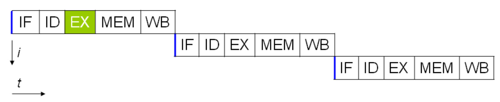

通过让处理器在同时时间执行指令的不同阶段，可以在一个时钟周期内完成取指、译码、执⾏、访存、写回五个环节，也就是其 IPC 性能达到1。 

Pipeline 可以在一个时钟周期内完成取指、译码、执⾏、访存、写回五个环节，也就是其 IPC 性能达到1.

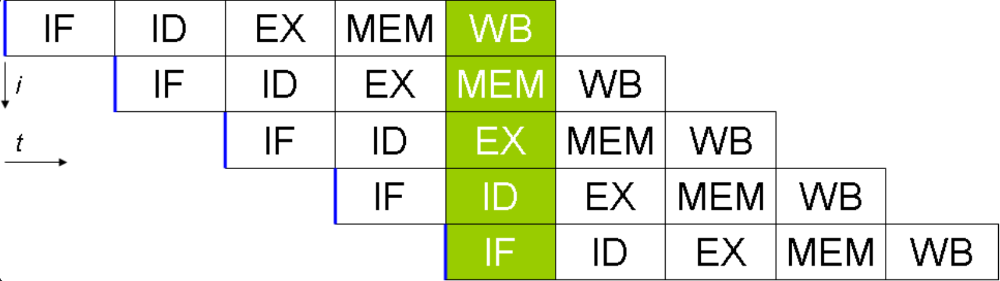

### 并行计算

在有不止一个处理器的时候，我们可以同时执行多条指令，也就是把不同的指令分配到不同的计算单元。如果我们有n个处理器，我们可以同时执行n条指令，我们处理任务的效率也就提升了n倍。这时候处理器的 IPC 性能就超过了1，我们说这样的处理器有超标量性能。

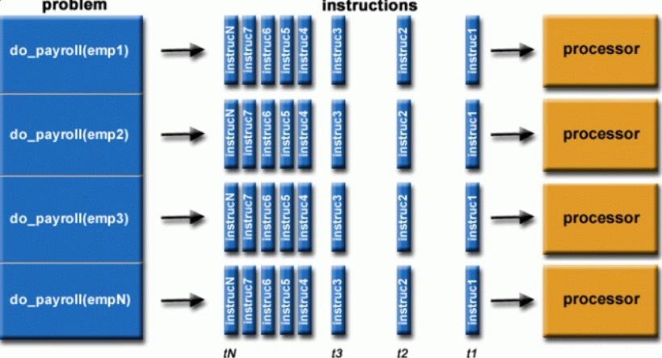

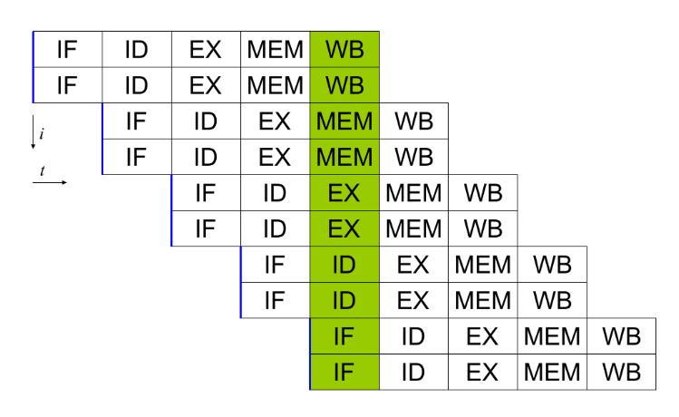

影响并行计算的指标有**延迟（Latency）和吞吐（Throughput）**。

延迟是一个计算单元的运算速度，也就是完成一次计算需要的时间，通常由计算单元设计、时钟频率、流水线深度以及内存层次等共同决定。

吞吐（Throughput）表示单位时间内完成的计算量。当任务具有足够并行性且计算资源能够被充分利用时，增加计算单元数量通常可以提高吞吐。

并行化（parallelization）是把一个原本串行的问题改造成可以并行执行的形式，是一种方法或过程。并行度（degree of parallelism, DOP）是某一时刻实际同时执行的任务数量，是一种指标。

在并行计算中，除了计算资源本身，数据访问效率同样重要。较高的数据局部性和缓存复用率能够减少内存访问开销，提高计算单元利用率，从而获得更高性能

## 从串行计算到并行计算

### 什么样的计算可并行？

一个计算过程能否并行，主要取决于：

1. 数据依赖关系（Data Dependency）

>如果一个计算需要另一个计算的结果，则必须按顺序执行；如果多个计算只依赖已有输入，则可以同时执行

2. 竞争、互斥与锁（Race, Mutual Exclusion & Lock）

> 多个任务访问共享资源时，可能产生竞争。例如多个线程同时修改同一个变量或者多个任务同时写入同一块内存。这时需要通过锁（Lock）、原子操作（Atomic Operation）和同步机制（Synchronization）保证计算结果正确。

3. 通信与同步（Communication & Synchronization）

> 并行任务之间通常需要交换数据或等待其他任务完成。如果通信量过大或者同步等待时间过长都会降低并行效率。高性能并行程序需要尽量减少通信，提高计算与通信比例。

### 哪些计算需要并行？

- 科学计算：气候模拟、物理模拟、生物模拟……
- 矩阵计算、逐元素计算：深度学习和人工智能

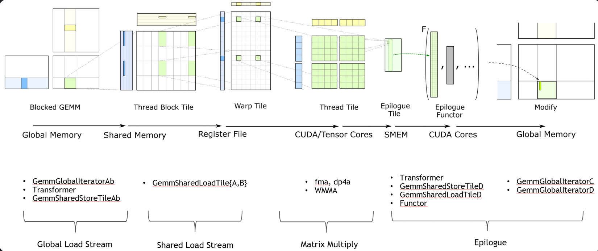

### 如何将任务切分到不同计算单元？

数据并行（Data Parallelism）、模型并行（Model Parallelism）、流水线并行（Pipeline Parallelism）和张量并行（Tensor Parallelism）。

在实际的大规模 AI 模型训练中，通常会结合多种并行方式形成混合并行（3D Parallelism）

**数据并行**:

将输入数据划分成多个子集，每个计算单元使用相同的模型处理不同的数据。

**域切分**：下图展示了对于一块任务数据，有着多种不同的划分方式。不同的切分方式对于任务的计算可能产生影响，需要根据任务类型、硬件特点等多种影响因素共同设计最佳方案。
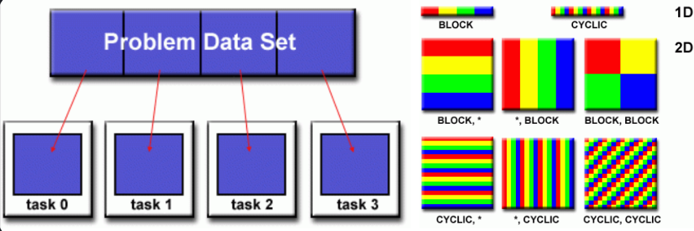

**功能切分**：按照功能将任务进行拆分，把相同类型的计算放到一起。
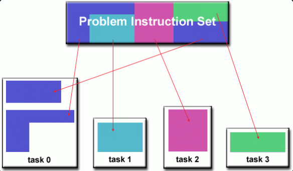

Transformer 中，我们将输入的数据切分后输入不同的 GPU，在不同的 GPU 上进行一部分计算，从而实现数据并行化。

**模型并行**:

将一个模型拆分成多个部分，分别放到不同计算单元执行，不同 GPU 保存不同的模型参数。

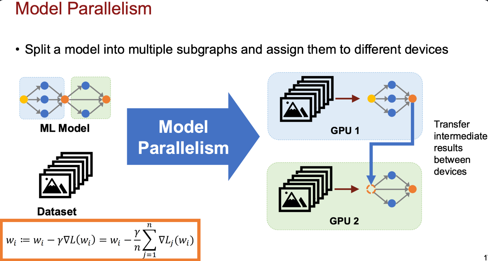

**流水线并行**:

将模型按阶段划分，让不同计算单元负责不同阶段，并让多个输入同时流动。通过类似生产线的方式，避免 GPU 空闲。可以类比 CPU 中的指令级并行。

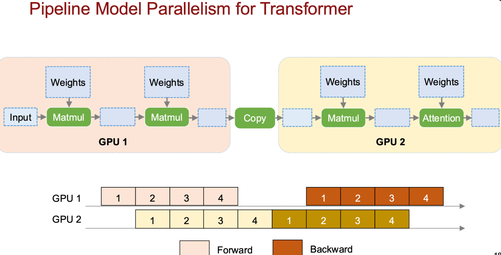

**张量并行**:

将单个计算操作内部的数据进行切分，让多个计算单元共同完成一次计算。张量并行的通讯频繁，要求 GPU 之间有高速互联
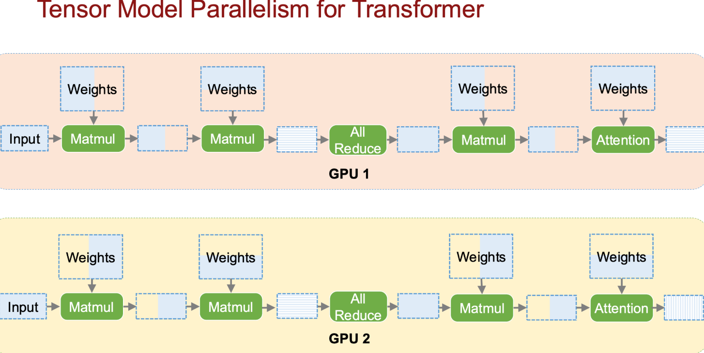

**三维并行**:

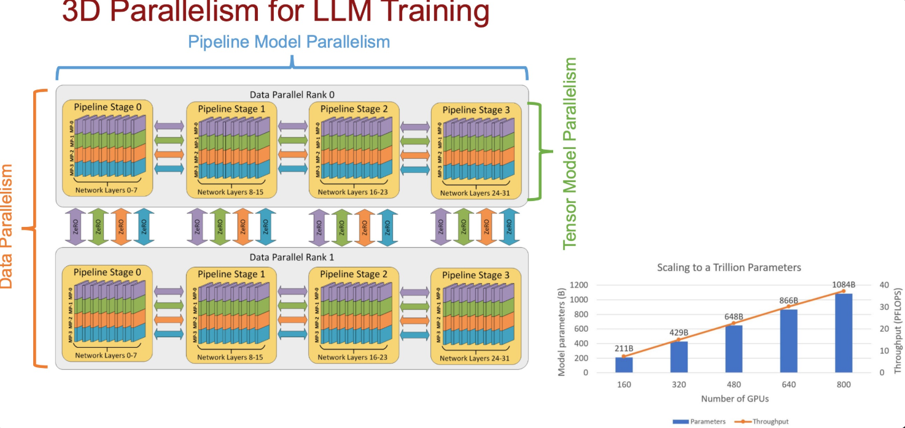


## 并行计算机:

如何实现并行计算？——指令与数据的组织方式
并行计算的核心问题是多个计算单元如何组织指令执行，以及如何处理数据。根据 指令流（Instruction Stream） 和 数据流（Data Stream） 的数量，Flynn 将计算机体系结构分为四类：

- SISD（Single Instruction Single Data）
- SIMD（Single Instruction Multiple Data）
- MISD（Multiple Instruction Single Data）
- MIMD（Multiple Instruction Multiple Data）

**SISD：单指令单数据**:

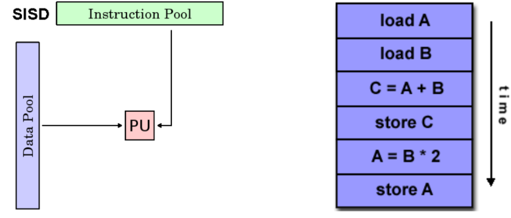

**SIMD：单指令多数据**:

同一条指令同时作用于多个数据。例如数组计算中可以把多条相同操作变成一条指令：

```cpp
c[0]=a[0]+b[0]
c[1]=a[1]+b[1]
c[2]=a[2]+b[2]
c[3]=a[3]+b[3]
```

to

```cpp
load a
load b
c = a + b
store c
```

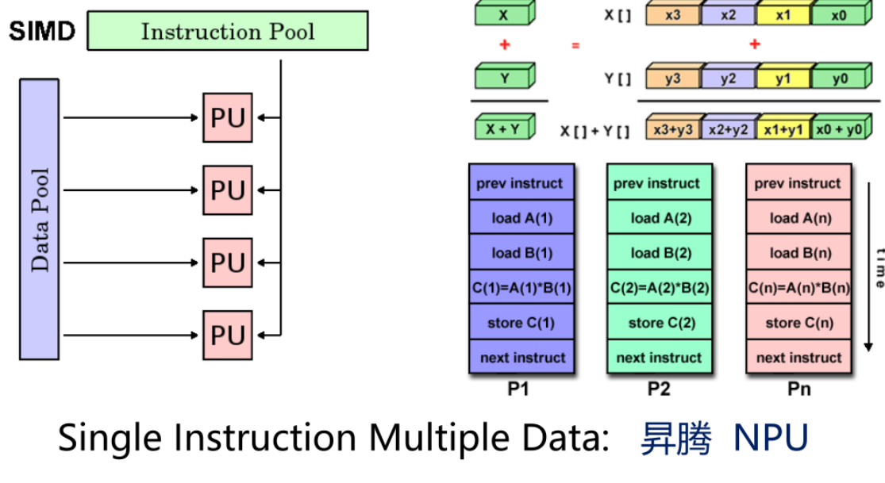

**MISD：多指令单数据**:

多个计算单元对同一个数据执行不同操作
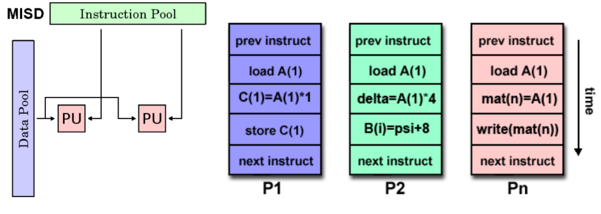

**MIMD：多指令多数据**

多个计算单元可以执行不同指令，同时处理不同数据，是现代并行计算最常见的模型。包括：

- 多核 CPU
- 多节点 HPC
- GPU（通常抽象为 MIMD + SIMT）

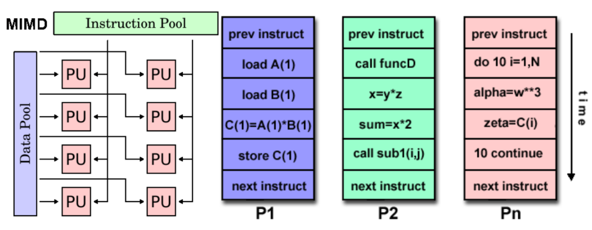


常见的并行编程模型包括：

- Shared Memory（共享内存）
- Threads（线程模型）
- Distributed Memory / Message Passing（分布式内存 / 消息传递）
- Data Parallel / Partitioned Global Address Space（数据并行 / 全局地址空间划分）
- Hybrid（混合模型）
- SPMD（Single Program Multiple Data）
- MPMD（Multiple Program Multiple Data）

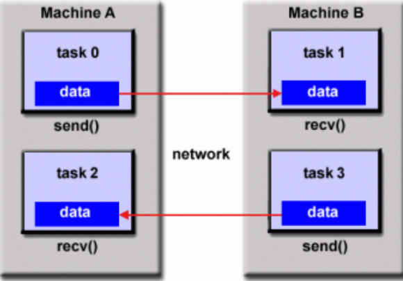
消息传递模型


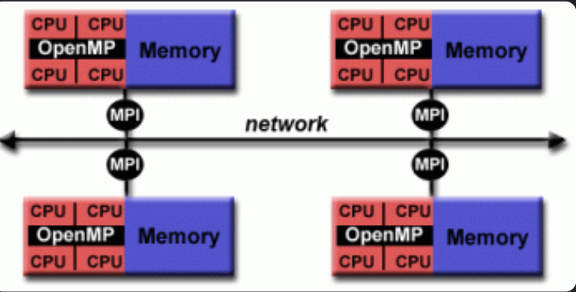
mpi 模型

## 如何实现并行计算？——“SIMT”模型 & CUDA（by NVIDIA）

GPU 编程是一种特殊的并行模型。CUDA 使用**SIMT（Single Instruction Multiple Threads）**思想：程序员编写线程级程序，由 GPU 自动组织大量线程执行。

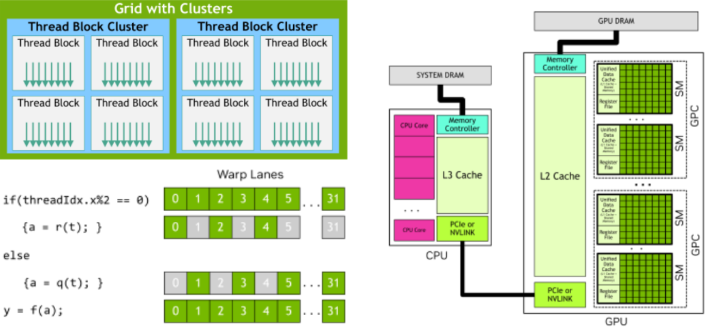

## 如何实现并行计算？—— Tile 模型 & Block 编程（by DSLs）

随着 AI 加速需求增加，出现了更高层的编程抽象，例如 Triton 和 TileLang。与 CUDA thread-level 编程不同，CUDA 关注线程，而 Tile 关注数据块（Tile）和计算块（Block）。

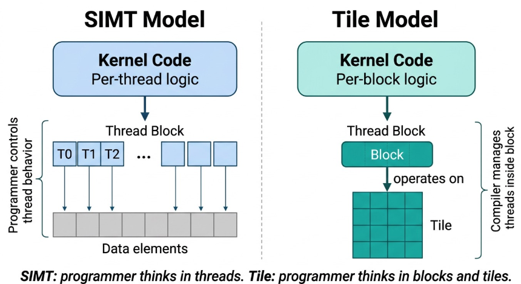

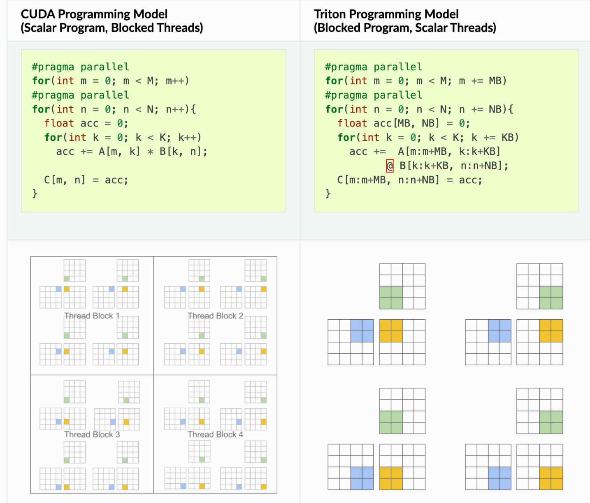

|层次|	关注问题	|代表|
|--- | --- | ---|
|硬件层	|如何执行指令和数据	|SIMD / SIMT / MIMD|
|编程模型层|	如何描述并行任务|	MPI / OpenMP / CUDA|
|高级抽象层	|如何表达计算结构	|Tile / Triton / DSL|

