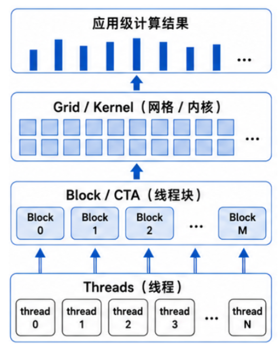
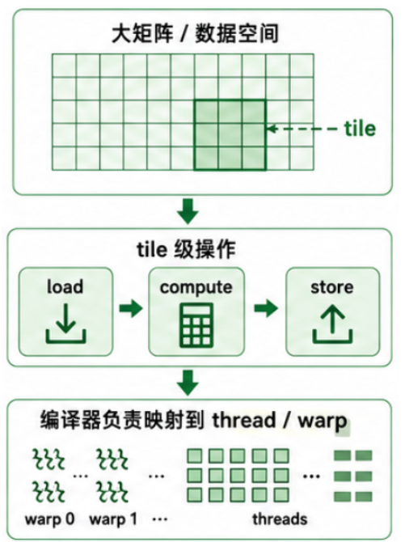
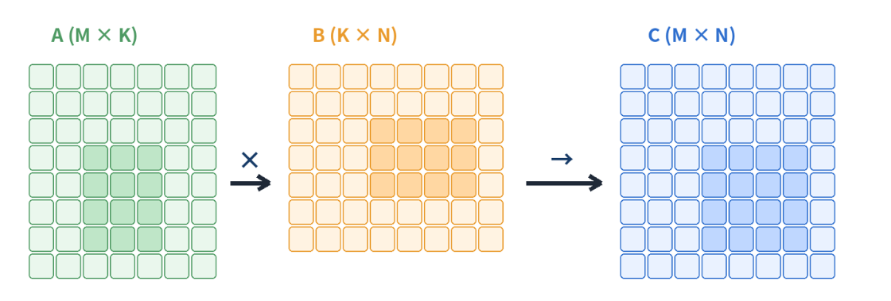

# Review: 关于 cuda kernel 映射到 GPU

**任务划分**
- 一个Kernel launch 一个 Grid
- Grid 被划分为多个独立调度的 Block / CTA
- 每个Block 内包含多个Thread,并以Wrap为单位执行

**数据存放**:
- Global memory: 容量大、延迟高、 所有Block可以访问
- Shared Memory: Block内共享，用于数据复用
- Register: Thread 私有，访问最快

**需要在代码中手动指定**:
- 每个block和 Thread 的分工情况
- 数据如何在 Global Memory \ Shared Memory \ Register 之间搬运
- 手动完成从“数据分块”到“线程执行”的映射

# 为什么需要 Tile-Level Programming？

SIMT 模型通过 thread、warp 和 block 提供了 GPU 并行计算的基本抽象，但在实现高性能计算 Kernel 时，程序员仍然需要手动管理**大量底层细节**。例如，在矩阵乘法等计算密集型任务中，需要自行设计 thread 之间的数据划分、同步方式以及 shared memory 的使用策略，以实现数据复用并减少 global memory 访问。

同时，还需要考虑 warp divergence、memory coalescing 等硬件相关优化。这种方式虽然能够获得较高性能，但编程复杂度较高，容易出错，并且需要大量 GPU 架构经验。


Tile-Level Programming 提供了一种更高层次的抽象方式。它将多个线程协作完成的计算过程抽象为对数据 tile（数据块）的操作，由程序员描述计算逻辑和数据布局，而由编译器负责将 tile 操作映射到底层线程、warp 以及硬件资源上。

一个典型的 Tile-Level Kernel 通常包括以下步骤：

1. 确定当前 tile 负责的数据区域
2. 从 global memory 中加载对应 tile 数据
3. 在 tile 内完成计算
4. 将结果写回 global memory，并处理数据边界情况

Triton 和 TileLang 都采用了 Tile-Level Programming 的思想，通过更高层次的编程模型描述 GPU 计算，将 CUDA SIMT 模型中复杂的线程管理、数据协作和硬件优化部分交由编译器处理，使开发者能够更加专注于算法结构和计算流程，同时获得接近手写 CUDA Kernel 的性能。

Triton和TileLang 都是 DSL（特定领域语言），是指相对于全面的 C++ 和 Python，这类语言是被设计在特定平台上完成特定任务的。CUDA 也是 DSL。

# Triton 编程模型

Triton 保留数据分块的决策，将线程级映射交给编译器。

CUDA Kernel 从 Thread 出发，显式计算每个线程负责的数据。

Triton Kernel 从 Program 出发，每个 Program 负责一个数据 Tile。程序员描述 Tile 的位置、形状以及 load / compute / store。编译器负责将 Tile 内的计算映射到 Thread 和 Warp。

CUDA：

Triton: 


# Triton 示例:

**向量加法**:
```py
import torch
import triton
import triton.language as tl


@triton.jit
def add_kernel(x, y, z, n: tl.constexpr, BLOCK_SIZE: tl.constexpr):
    pid = tl.program_id(0) # 0是维度，是横坐标
    offsets = pid * BLOCK_SIZE + tl.arange(0, BLOCK_SIZE)
    mask = offsets < n # 有些会超出去

    x_val = tl.load(x + offsets, mask=mask, other=0.0)
    y_val = tl.load(y + offsets, mask=mask, other=0.0)
    out = x_val + y_val

    tl.store(z + offsets, out, mask=mask)


def add(x, y):
    z = torch.empty_like(x)
    n = x.numel()
    block_size = 1024
    grid = (triton.cdiv(n, block_size),)
    add_kernel[grid](x, y, z, n, BLOCK_SIZE=block_size)
    return z
```

执行过程
- 每个program负责 BLOCK_SIZE 个连续元素
- offsets 表示当前 program 负责的全局下标
- mask 处理最后一个不完整Tile
- tl.load 从x和y中读取tile
- out = x_val + y_val 逐元素加法
- tl.store 写回 z


**矩阵乘法**:

A: (M, K)，B: (K, N)，C: (M, N)
每个 program 负责计算 C 的一个 BLOCK_M × BLOCK_N tile



```py
@triton.jit
def matmul_kernel(
    A, B, C,
    M: tl.constexpr, N: tl.constexpr, K: tl.constexpr,
    stride_am: tl.constexpr, stride_ak: tl.constexpr,
    stride_bk: tl.constexpr, stride_bn: tl.constexpr,
    stride_cm: tl.constexpr, stride_cn: tl.constexpr,
    BLOCK_M: tl.constexpr, BLOCK_N: tl.constexpr, BLOCK_K: tl.constexpr,
):
    pid_m = tl.program_id(0)
    pid_n = tl.program_id(1)

    offs_m = pid_m * BLOCK_M + tl.arange(0, BLOCK_M)
    offs_n = pid_n * BLOCK_N + tl.arange(0, BLOCK_N)
    offs_k = tl.arange(0, BLOCK_K)

    acc = tl.zeros((BLOCK_M, BLOCK_N), dtype=tl.float32)

    for k0 in range(0, K, BLOCK_K):
        a_ptrs = A + (offs_m[:, None] * stride_am +
                      (k0 + offs_k[None, :]) * stride_ak)
        b_ptrs = B + ((k0 + offs_k[:, None]) * stride_bk +
                      offs_n[None, :] * stride_bn)

        a = tl.load(a_ptrs,
                    mask=(offs_m[:, None] < M) &
                         (k0 + offs_k[None, :] < K),
                    other=0.0)

        b = tl.load(b_ptrs,
                    mask=(k0 + offs_k[:, None] < K) &
                         (offs_n[None, :] < N),
                    other=0.0)

        acc += tl.dot(a, b)

    c_ptrs = C + (offs_m[:, None] * stride_cm +
                  offs_n[None, :] * stride_cn)

    c_mask = (offs_m[:, None] < M) & (offs_n[None, :] < N)

    tl.store(c_ptrs, acc, mask=c_mask)


def matmul(A, B):
    M, K = A.shape
    K2, N = B.shape
    assert K == K2

    C = torch.empty((M, N), device=A.device, dtype=torch.float32)

    block_m, block_n, block_k = 16, 16, 32
    grid = (triton.cdiv(M, block_m), triton.cdiv(N, block_n))

    matmul_kernel[grid](
        A, B, C,
        M, N, K,
        A.stride(0), A.stride(1),
        B.stride(0), B.stride(1),
        C.stride(0), C.stride(1),
        BLOCK_M=block_m,
        BLOCK_N=block_n,
        BLOCK_K=block_k,
    )

    return C
```

# Triton 的局限性

- 编译器是黑盒：shared memory 布局、bank conflict 全靠编译器
- 生成的 PTX / SASS 不透明，性能问题难定位
- 性能天花板：距 CUTLASS / cuBLAS 手工优化仍有差距
- 复杂 pipeline、warp specialization 难表达
- 复杂 kernel写起来别扭
- 报错和性能回退难分析，依赖反复 autotune

Triton 用放弃部分控制权换开发效率。当控制权成为瓶颈时，就需要 TileLang 或更底层工具。

# TileLang 编程模型

TileLang 更强调显式写出层次结构：

- kernel / program：GPU kernel 入口
- global memory：输入输出张量所在显存
- shared memory tile：CTA 内共享的缓存块
- loop over tiles：沿某维度分块循环

Triton 更接近张量表达式，TileLang 更接近手写 CUDA 的 kernel 结构

TileLang 提供了三个层次的编程抽象，每个层次对应不同的控制粒度和适用场景。

|维度	|Level 1 (Hardware-Agnostic)	|Level 2 (Tile-Level)|	Level 3 (Thread-Level)|
|-- | -- | - | - |
|并行控制	|隐式（由编译器决定）	|显式 Grid/Tile/Block 内并行	|显式 Thread/Warp/WarpGroup|
|内存控制	|隐式（Global Memory 直访为主）	|显式 Shared Memory / Local Register / Fragment	|显式 Register 与 ISA 级访存
|计算映射	|自动调度	|T.gemm 等 TileOp + Software Pipeline	|Inline PTX/ISA、手写微内核
|典型性能	|中（依赖编译器）	|高	|最高（局部热点）
|可移植性	|高	|中-高	|低-中（随硬件变化）
|复杂度	|低	|中	|高
|适用场景|	原型、通用算子、教学	|主力实现、性能工程|	瓶颈路径、特殊指令

# TileLang primitives

**定义与启动**:

- `@tilelang.jit`: 生成并编译可调用的 kernel
- `@T.prim_func`: 定义 Tile-Level 函数
- `T.kernel(...)`: 创建grid,一个实例对应一个CTA

**内存层次**:
- 函数参数 `T.Tensor`: Global Memory
- `T.alloc_shared`: CTA共享的输入Tile
- `T.alloc_fragment`: 寄存器中的计算结果

**数据流和计算**:
```
Global Memory ---> Shared Memory ---> Register Fragment ---> Global Memory
             T.copy             T.gemm                 T.copy
```
- `T.Pipelined`: 沿 K 维度分块，并重叠搬运与计算
- `T.copy`: 表达不同内存层次之间的数据搬运
- `T.gemm`: 表达Tile级的矩阵乘加

# TileLang Matmul

TileLang 的核心结构：

- 显式分配 shared memory tile：A_shared、B_shared 存储输入数据块
- 分配 register fragment 作为累加器：C_local 累积中间结果
- K 维分块循环，支持 pipeline：每轮从 global 搬运数据到 shared，调用 gemm 更新 C_local
- 循环结束后写回 global memory


```py
import tilelang
import tilelang.language as T


@tilelang.jit
def matmul(
    M: int,
    N: int,
    K: int,
    BLOCK_M: int,
    BLOCK_N: int,
    BLOCK_K: int,
    dtype: str = "float16",
    accum_dtype: str = "float32",
):
    @T.prim_func
    def main(
        A: T.Buffer((M, K), dtype),
        B: T.Buffer((K, N), dtype),
        C: T.Buffer((M, N), accum_dtype),
    ):
        with T.Kernel(
            T.ceildiv(N, BLOCK_N),
            T.ceildiv(M, BLOCK_M),
            threads=128,
        ) as (bx, by):
            A_shared = T.alloc_shared((BLOCK_M, BLOCK_K), dtype)
            B_shared = T.alloc_shared((BLOCK_K, BLOCK_N), dtype)
            C_local = T.alloc_fragment((BLOCK_M, BLOCK_N), accum_dtype)

            T.clear(C_local)

            for k in T.Pipelined(T.ceildiv(K, BLOCK_K), num_stages=3):
                T.copy(A[by * BLOCK_M, k * BLOCK_K], A_shared)
                T.copy(B[k * BLOCK_K, bx * BLOCK_N], B_shared)
                T.gemm(A_shared, B_shared, C_local)

            T.copy(C_local, C[by * BLOCK_M, bx * BLOCK_N])

    return main
```

# 小结

**Triton**:

- 快速写出简洁 kernel
- 适合 elementwise、reduction、matmul、attention

**TileLang**:

- 显式表达内存层次和数据复用
- 适合讲清高性能 kernel 结构

**CUDA C++**:

- 控制粒度最细
- 适合极端性能调优或特殊硬件机制