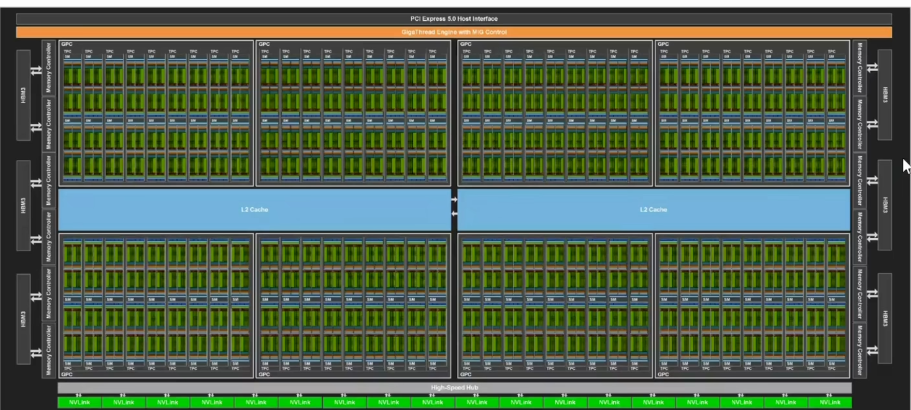
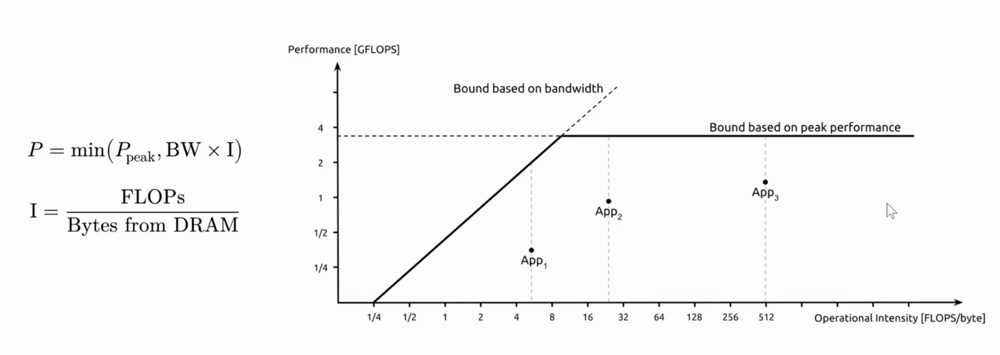
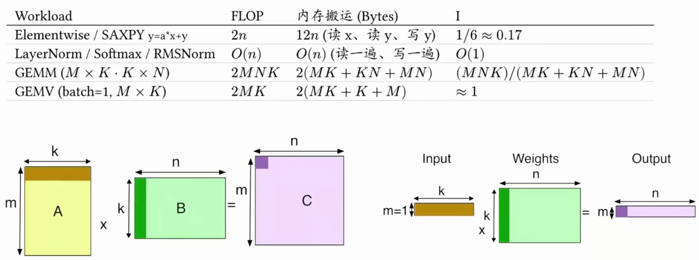
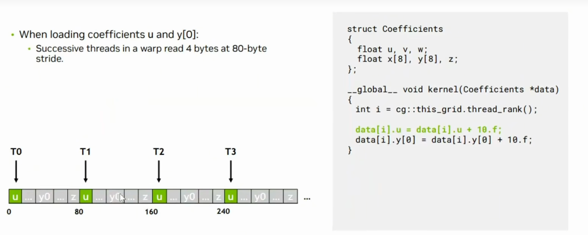
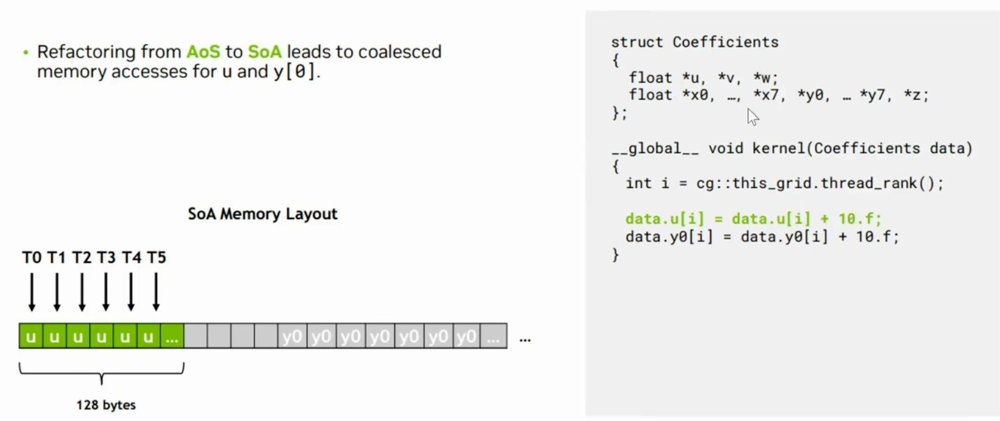
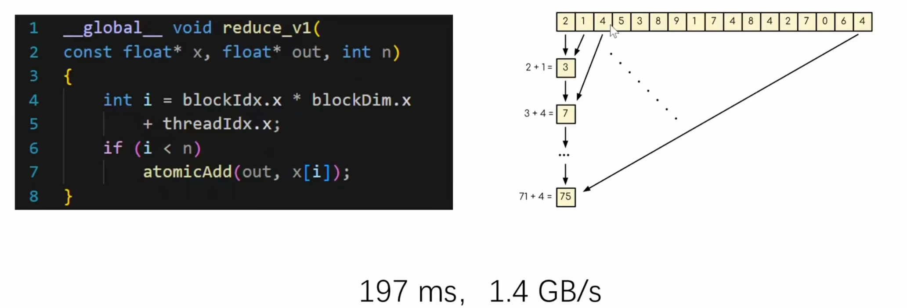
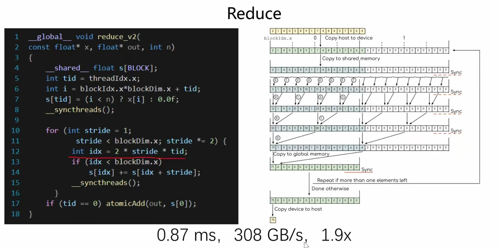
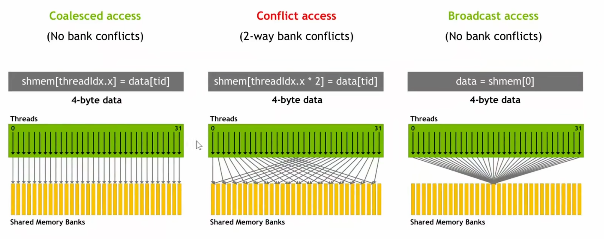
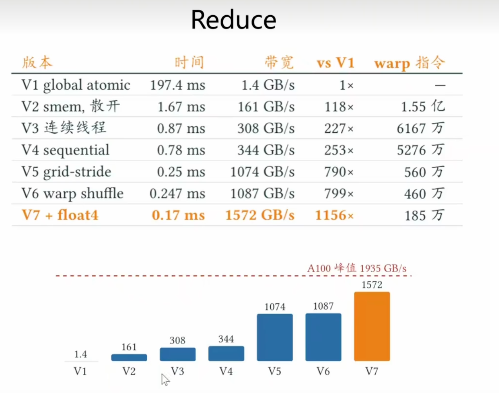

# 2.Memory Abstraction Hierarchy

数据从HBM移动到SM内，再从SM计算后回到HBM，瓶颈在于计算和传输。

CS336里面已经学过了，Element-wise,LayerNorm的计算强度都很低，只有GEMM有机会达到Compute-bound

在飞字节数 = 带宽 x 延迟

每 SM 在飞字节 = 驻留warp数 x 32 x 单指令字节数 x MLP
      

- warp 数目： occupancy
- 单指令字节数：向量化
- MLP： 展开

提高 in-flight 数量的方法

- 一种是指令级并行（ILP）：同时发射更多相互无关的指令；
- 另一种是线程级并行（TLP）：让更多线程同时执行。

方法:

1. 循环展开
2. 提高Occupancy
3. 向量化访存

**访存合并（coalescing）与缓存层次**

不相邻,访问情况很差

如果是这种SoA,访问情况就很好  array of structures（结构体数组）和 structure of arrays（数组结构体）

如果是结构体数组：每个结构体本身连续存放，数组就是不同结构体排在一起；同时相邻的 thread 访问不同结构体的同一个字段（比如都访问 u）时，内存里相邻结构体的 u 实际上隔得很远（中间隔了其他字段，本例中约 80 字节）。这样的话，一个 sector 里只有大约 4/32 的数据被用到，访问效率非常低。

如果是结构体数组（SoA）：结构体里装的是数组，每个数组内部连续。访问 u 时，相邻线程的 u 就是连续的；访问 y0 时，相邻线程的 y0 也是连续的。这样每个 sector 的数据全部都能用到。

# Reduce 的优化问题

最简单的方法一个一个加

优化 1：shared memory + 树形 reduce：首先把输入数组 copy 到 shared memory 里，防止重复访问 global memory；然后每个 block 在内部做树形 reduce：先把相邻两个元素加起来，再把加完后的相邻两个结果加起来。这样比原子变量快 118 倍。

但有一个问题：右图圆圈里的数字（每次执行时的线程 id）并不连续。也就是说 warp 的 32 个线程里，每次是第 0、第 2、第 4 个……这样的线程在执行，一半线程被浪费了，之后的轮次用得越来越少、浪费更多。

优化 2：让连续的线程操作。 优化方法就是每次都由连续的 thread 来操作，减少总的 warp 数量。之前的写法是每个 thread 操作的位置固定；现在改成线程根据自己的 id 计算出要操作的位置 id，再判断这个位置是否在范围内。

但这样又带来新问题：bank conflict。shared memory 分成很多 bank，以 4 字节为单位，连续 4 字节在相邻的 bank，但过了 128 字节就循环：128～132 字节和 0～4 字节是同一个 bank。warp 里的不同线程如果访问同一个 bank，就无法在一个周期内把数据同时给两个线程，对 bank 的请求会被串行化，这就是 bank conflict，所以我们要尽量避免同一个 warp 里的线程访问同一个 bank。

优化 3：让相邻线程访问相邻数据 

每个 thread 加自己的 index 和 warp index 之后的下一个数据，这样每个 thread 访问的数据就是连续的，同时也能避免 bank conflict。速度从 308 GB/s 提升到 344 GB/s

但这时出现新问题：计算吞吐已经达到 62%，DRAM 吞吐只有 18%。reduce 本来应该是一个 memory-bound 的 kernel，现在却变成了 compute-bound，说明肯定有问题。

原因：block 数量是随数据长度变化的，而不是固定数量。block 数量特别多，同时 reduce 操作的数量与 block 数量成正比，所以我们做了非常多次不必要的 reduce 操作。

优化 4：减少 block 数量，让每个 block 做更多操作

让每个 thread 做更多的读取和加法操作，减少因为 reduce 引入的额外加法；如果是在 shared memory 内部操作，串行加法不会引入任何不必要的算术。这样整个指令数下降，从 0.78 ms 降到 0.25 ms，大约 3 倍提升

优化 5：warp shuffle

实际上 thread 之间有直接交换数据的路径，不需要经过 shared memory，可以直接在寄存器之间用 warp shuffle 交换，指令大概有几种:

- broadcast（shfl）：所有 thread 接收一个指定的 source 发来的数据；
- up / down：每个 thread 把自己的数据传给自己后面/前面固定 offset 的 thread（offset 固定）；
- xor：每个 thread 把自己的线程 id 与传入的 mask 取异或，接收异或结果那个 index 的线程的数据。

