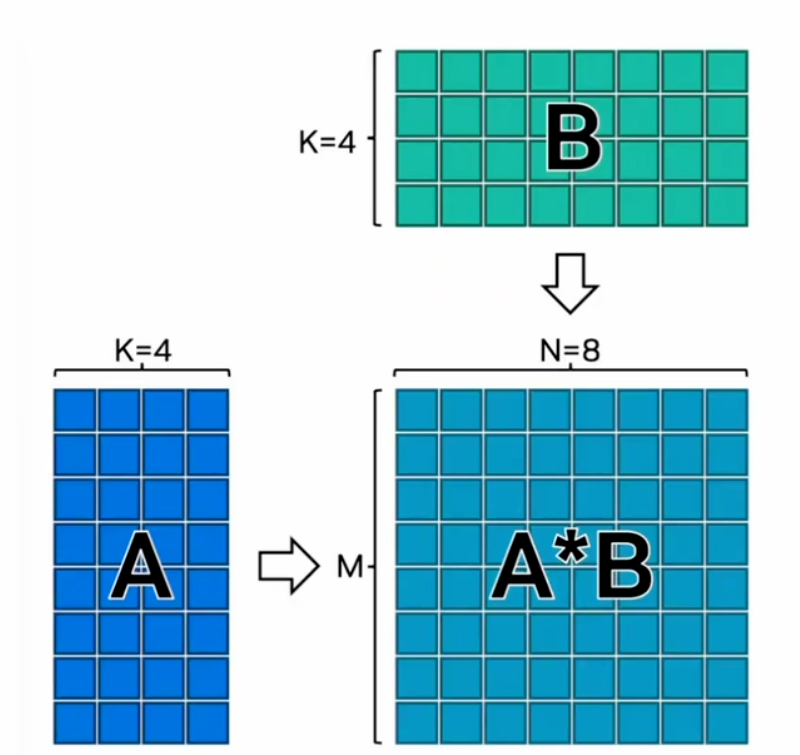
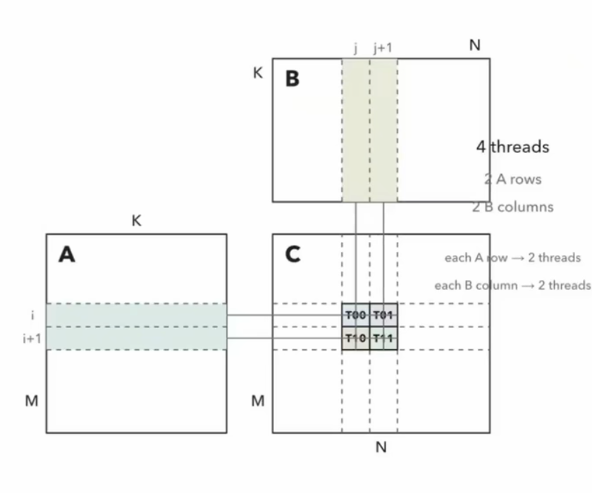
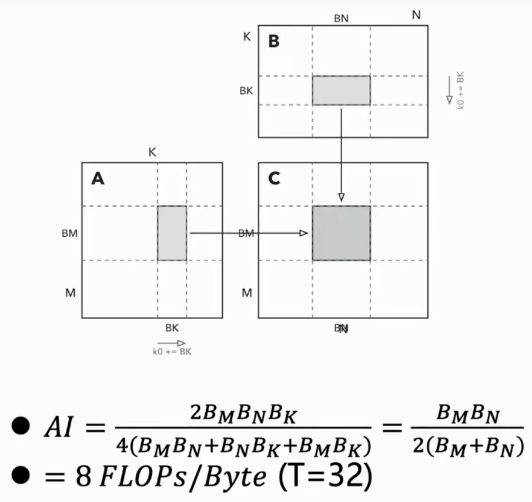
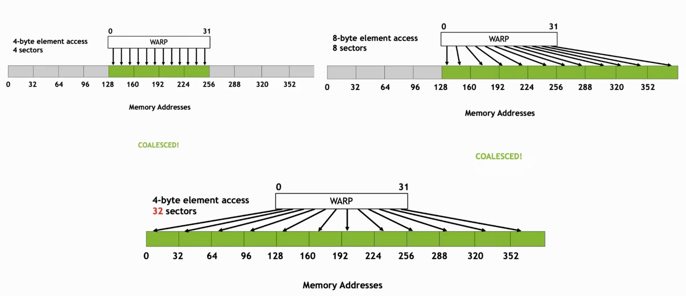

# 为什么选 FP32 GEMM

GEMM 是什么。传统说法是 General Matrix Multiplication

左边是 A，右上方是 B，相乘得到 A×B；每个输出元素对应它在 A 中向左找的那一行、在 B 中向上找的那一列，把 A 和 B 对应位置的元素乘积求和



优化目标是什么？

>我们算的基本上都是浮点数的乘加。这里以 FP32 的乘加为例：把一次乘法、一次加法叫做一次 FMA，乘和加统一记为 1 个 FLOP .优化目标，就是在相同时间内算出最多的 FLOPs。

为什么选 FP32 GEMM:
- 它足够简单。
- 矩阵乘法实在太常见，现代专用加速器上为了优化各种 GEMM，都会引入类似 tensor core 的计算单元来专门特化乘法计算
- 一张 GPU 上 FP32 的裸算力，基本上就是 CUDA core 能够提供的算力。所以它很适合我们从纯手动的角度出发去写计算

# 最简单的并行实现

```cpp

__global__ void gemm_naive(
  const float* __restrict__ A,
  const float* __restrict__ B,
  float* __restrict__ C,
  int M, int N, int K
){
  int row = blockIdx.y * blockDim.y + threadIdx.y;
  int col = blockIdx.x * blockDim.x + threadIdx.x;

  if (row >= M || col >= N) return;

  float acc = 0.0f;
  for (int k = 0; k < K; ++k) {
    acc += A[row * K + k] * B[k * N + col];
  }
  C[row * N + col] = acc;
}

dim3 block(16, 16);
dim3 grid(ceil_div(N, 16), ceil_div(M, 16));

gemm_naive<<<grid, block>>>(A, B, C, M , N, K);

```

矩阵乘法要算很多独立的输出元素：每个输出元素涉及读 A 的一行、B 的一列，把它们乘起来、做点乘、加起来。并行化本身，就是把计算数据拆到硬件上很多可以同时执行的单元上面。

CUDA 提供了一套编程抽象，从 grid 到 block 再到 thread：一堆 thread 组成一个 block，block 会共享 shared memory 之类的资源; blocks 之间又组成一个 grid。这个层次正好可以映射到我们的 GPU 上面。

CUDA 给每个层级的索引都提供了 3 个维度，但在这里，输出 C 是一个 M×N 矩阵，我们用两维就足够了：

先把 C 这个大矩阵整个切成一堆大的 tile。用 block index 让每个 CTA 索引到 C 的一个输出 tile；在这个输出 tile 内，block 里的每个 thread 负责一个小的元素，用二维的 threadIdx 索引到具体元素。

代码思路:
- 先用 block index 找到这个 block 第一个元素所在的位置。每一行的话，就是"它在第几块 × 每块负责多大"， 再加上它在 block 内的偏移，就可以定位到一个输出元素。
- 每个 thread 在寄存器里维护一个累加器，直接去读 A 的一行、B 的一列，挨个读、挨个乘，累加到一起。 
- 调用方法很简单：定义 block 的大小，比如这里随机选了 16；整个 grid 需要启动 N /16 向上取整， M/16  向上取整这么多个block，用 <<<grid, block>>> 启动 kernel。

# 朴素实现的问题：没有数据复用



比如这里：位置上相邻的 4 个 thread 要算 C 的 4 个输出，它们用到的 A 的行和 B 的列是可以复用的——每两个 thread 会用到 A 的一行，所以实际上只需要两行 A 和两列 B。

回顾一下 roofline 的概念。我们想要达到的理论算存比（FLOP/byte）是

$$ AI = \frac{2MNK}{4(MK + KN + MN)} $$

上面是计算量， MxN 个输出，每个线程要算 K次乘加，每次乘加2次操作，2MNK。  下面是访问ABC三个矩阵的字节数。 对于方阵而言，值就是 $ \frac{N}{6} $

也就是说，在算很大的 GEMM 时，计算相对于缓存来说非常多，数据被非常激进地复用

但是朴素实现不是这样，K次乘加却使得每个线程访问了2K个输入和1个输出，算存比是 2K/(2K+1) ，当 K 很大时，算存比接近 1，远低于理论值 N/6。也就是说，数据没有被复用。

# Shared memory tile 版本：显式复用数据

GPU 体系结构给程序员提供的编程模型是：每个 block 会有一个 scratch pad 来复用数据，block 内的线程可以共享它、往里面写和读，这就是 shared memory。

熟悉其他体系结构的同学可能会想到 cache。也就是说，我们希望硬件自动捕获一些时间或空间上的局部性。

但 GEMM 实在太规整了——即使开始会捕获一部分复用，我们也很容易提前知道哪些数据是可以复用的，不需要在运行时根据一些无法预测的规则去做这件事。

所以不如把这块 scratch pad 拿过来给自己用，也就是把整个 local memory 层次的东西拿来当 shared memory，显式地组织 thread 之间的协作。

每个 CTA 内部共享一片 shared memory，它们一起组成了一个中间 tile（图中灰色那块），大小是 block_M × block_N。


写法:

```cpp
constexpr int T = 32; // BM = BN = BK = T
__shared__ float As[T][T];
__shared__ float Bs[T][T];

int tx = threadIdx.x, ty = threadIdx.y;

int row = blockIdx.y * T + ty;
int col = blockIdx.x * T + tx;
float acc = 0.0f;

for (int k0 = 0 ; k0 < K; k0 += T) {
  As[ty][tx] = load_A(row, k0 + tx);
  Bs[ty][tx] = load_B(k0 + ty, col);

  __syncthreads();
  for (int k = 0; k < T; ++k) {
    acc += famf(As[ty][k] , Bs[k][tx], acc);
  __syncthreads();
  }
}
```

- 用 __shared__ 语法开两个 A 和 B 的 scratch pad。
- 对规约的 K 维度也进行切分（这里为了简单，都写成 tile 大小）。
- 循环主体里：先让每个 thread 分到一部分数据，加载到 A、B 的 scratch pad 中。这部分加载和后面的计算是相对独立的——只需要把这一片数据搬进来就行，不像之前每个线程都要做有重复的读取。
- 搬完之后要同步一次：因为在 warp scheduler 下，没有任何关于 shared memory 版本可见性的立即保证，所以必须加一个 barrier（__syncthreads()），等数据写完之后才能进行下一步计算。
之后算 FMA，和刚才一样，只是把读的位置换成 shared memory：累加器每次加上 shared memory 里对应的位置，遍历 K。
- 在循环末尾当然也要再同步一次。因为如果不 sync，跑得快的 warp 可能会进入下一次循环、提前 load 下一块 A 和 B；而这里只有一片 shared memory 空间，下一次数据可能会把还没被计算的那部分数据提前覆盖掉，导致问题。所以这里需要两个同步点。


# Coalescing：如何把数据搬进 shared memory

怎么让那些 thread 把数据合并地搬进 shared memory？这里用到刚才学的知识：不是 global 缓存的 coalescing 版本——一个 warp 最好访问的是能够打包起来的、连续的、对齐的一片地址。

比如左边：每个 thread 访问 4 字节（一个 float），整个 warp 访问的东西就是 128 字节对齐的、连续的 4 个 sector，这对把所有请求打包起来很有好处。



另一种情况：每个访问 8 字节，整个 warp 访问 8 个 sector，仍然是连续并且对齐的。

那么怎么知道访问是不是连续的呢？ 这里很多时候遵循某种主序。比如 C 风格的数组一般是行主序：行是最外层那一维，列是连续的那一维。对 A[i][j]，变动 j 这个维度是连续的——比如第 2 行第 1 列和第 2 行第 2 列是挨着的；索引计算里 j 这一维的 stride 是 1，它就是连续变动的维度。

CUDA 对 thread 的规定是：thread 在映射到原始的线性化 index 时，`threadIdx.x` 是最连续的方向。所以我们要把这两个维度对齐：让 threadIdx.x 作为连续方向的索引，尽量让它做数组下标里"列"的那一位，这样写会产生更好的效果。

# 向量化访存（float4）

# NCU 分析：为什么还会有 stall

看一下这个版本的一些问题。虽然我们做了 shared memory tile，但所有东西并不是持续发射的。这里需要提一下 NCU 的 warp 分类：

- active warps：资源足够，可以驻留到一个 SM 上的 warp。不管它们状态如何，只要拥有执行上下文（分到了寄存器、shared memory 等对应资源），就被认为是 active。

- eligible：active，并且当前下一条指令可以发射。可以发射的意思是：没有数据依赖、没有在等任何其他数据的完成，而且对应的 pipe 也空出来能给我们用。比如访问 global 或 shared memory 时打了太多请求、请求堆积起来、带宽跟不上，攒下来的请求排不上队，新的请求就无法发射到这些 pipe 上，这时它们就不再是 eligible。

# 更细的工作分配：tile 内 thread 负责多个输出

shared memory 版本更好之后，我们可以考虑在 tile 内部再做工作分配：tile 内的 thread 也可以分一个更小的分工去解决整个问题。这样算 TM 和 TN 是结构相似的——thread 为了计算这几个结果，不需要重复读那么多遍 TM 和 TN 的数据。

进行这样的二维切分会带来更好的事情：

- 每个 K 位置读两个 A、两个 B，做四次 FMA；如果按正常做法，需要读四个 A 和四个 B。

- 每个 thread 负责更多输出，也解放了线程数。比如 4096 的 GEMM 画成 32×32 的 tile，32×32=1024 个 thread，这差不多是 A100 能驻留线程数上限的一半了。如果我们有更多空闲线程，就可以允许更大的 CTA 出现。

- 根据刚才的算存比，能达到的 AI 随 tile 增大而变好，数据复用变得更好。让 thread 负责更多的计算，我们可以用剩下的 thread 把 AI 往更高的方向再推一些。
